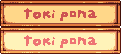

# Stardew Valley toki pona translation

This is a fan-made translation of Stardew Valley to toki pona. Still in very early development!

## Contributing

The projectis free for any tokiponists to help!

* Of course, you are required to have familiarity speaking toki pona.

* All the translations are directly written in JSON files.

* You're empowered to translate several strings of text in a single commit, but they should all be related, like coming from the same file, game scene or character.

* Only _nimi pu_ and _nimi ku suli_ are accepted, thought there may be exceptions in certain cases. Rare _nasins_ usage are free to be discussed in the issues.

* All characters, places and objects names must be the same in all texts. If unsure, most (if not all) names are in `assets/Strings/`; for example, for the list of characters names check `assets/Strings/NPCNames.json`. If a name still hasn't been translated, feel free to do it yourself!

* Proofreading is also needed. Feel free to change any text already translated.

* When editing images, use the same font style and colors of the source.

### For programmers

The structure of the project is based on Content Patcher. There might be issues with format or missing files that I have missed, or might cause the mod to break. If you detect flaws in the structure, please leave an issue or pull request.

## Installing

You need to setup SMAPI and install Content Patcher to run this mod. Read [this guide](https://www.stardewvalleywiki.com/Modding:Player_Guide/Getting_Started). Then place the project folder in your system's `Mods` path.

## Contact

Contact me on Discord (`@velho.sieni`) if needed.

I am not a great project manager. All feedback in the workflow and documentation is appreciated!
