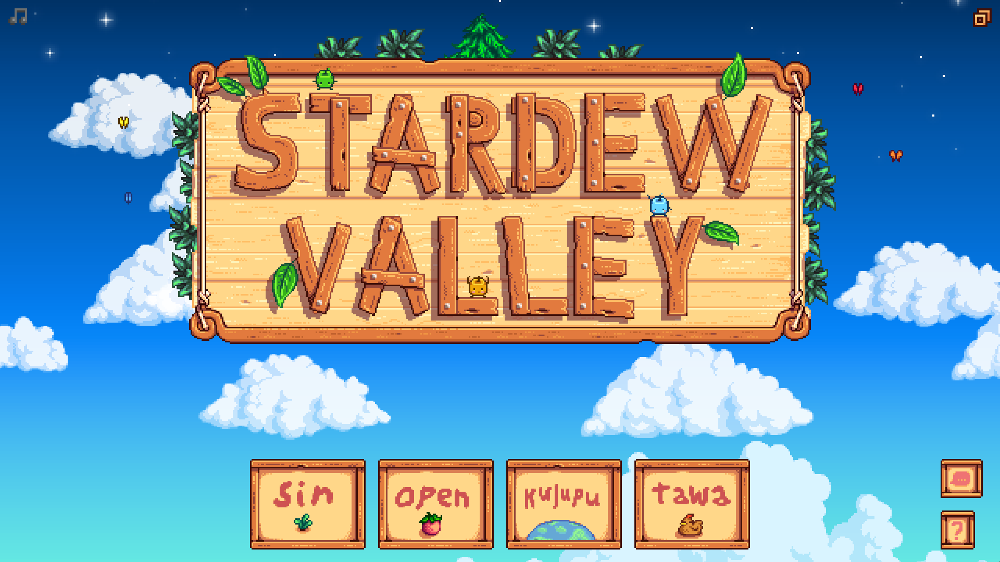

# Stardew Valley translation into toki pona

This is a fan-made translation mod of Stardew Valley to toki pona. It is still in very early development!

## Contributing

The project is open for any tokiponists to help! Please contribute by translating and proofreading strings. All the translations are directly written in JSON files. The formatting is explained in [this article](https://stardewvalleywiki.com/Modding:Dialogue) from the Stardew Valley Wiki.

### Language

* Only [core and common words](https://sona.pona.la/wiki/Usage_categories) are accepted, thought there may be exceptions in certain cases. Please consider keeping to a widely understood style of speech. Language policy may be discussed in the issues.
* The names for the characters, places and objects must be the consistent across all texts. If unsure, most (if not all) names are found in the `assets/Strings` directory; for example, for the list of characters names check `assets/Strings/NPCNames.json`.
* When editing images, use the same font style and colors as the source.

### For programmers

The structure of the project is based on Content Patcher. There might be issues with format or missing files that might cause the mod to break. If you detect flaws in the structure, please leave an issue or pull request.

## Installing

Read [this guide](https://www.stardewvalleywiki.com/Modding:Player_Guide/Getting_Started) to get started with mods. SMAPI and [Content Patcher](https://www.nexusmods.com/stardewvalley/mods/1915) are required mods. Download this repository as a `zip` and extract it in your system's `Mods` path.

## Contact

Contact me on Discord (`@velho.sieni`) if you need anything.
